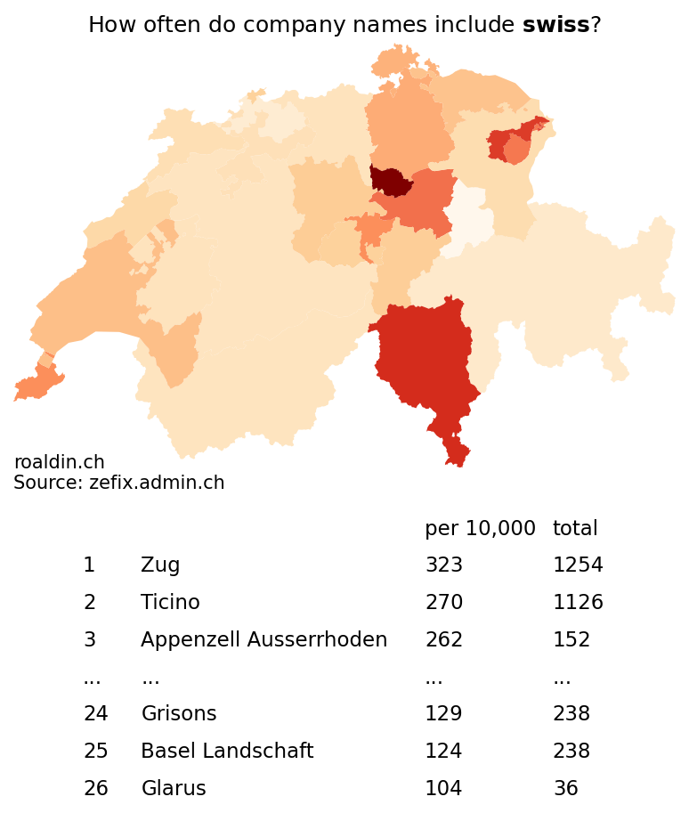

# Switzerbrand

The brand Switzerland is quite popular. Many Swiss manufacturers include the Swiss flag in their logo or on their product. Some include the name of the country in their name. For example, swisscom (telecom), swissquote (broker) or swiss sense (mattresses).

Here I use the Federal Office of Justice's [ZEFIX database](https://www.zefix.admin.ch/) to check how often companies use 'swiss', in five languages, in their name.

Code is based on [this example notebook](https://jupyter.zazuko.com/zefix.html) ([Github](https://github.com/zazuko/notebooks/blob/master/notebooks/zefix/zefix.ipynb)).

_Data retrieved on 12 March 2023_

